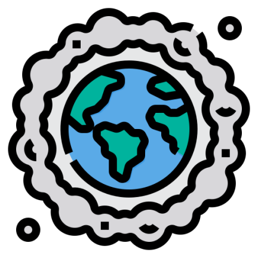

<h1 align="center" id="title">Polluted</h1>

    
    
    
    

    

Polluted is an Android app that estimates the pollution level based on a real-time sky photo. It utilizes two machine learning classifiers: one for pollution level estimation and another for sky recognition. The final output is computed by incorporating additional information stored in a Firebase Firestore Database. For more details, please refer to the <a href="https://github.com/mirawara/Polluted/wiki">Wiki</a>.

  
  
<h2>🧐 Features</h2>

Here're some of the project's best features:

*   Pollution level estimation
*   Firestore database geoqueries and aggregation
*   Opencv image preprocessing
*   Sky recognition

<h2>🧠 Classifier:</h2>
The classifiers were built using <a href="https://teachablemachine.withgoogle.com/">Google teachable machine</a>. They are in tensorflow-lite format in app/src/main/assets/.

<h2>🛠️ Use Configuration:</h2>

After cloning the repository you have to create your own Firebase project and to update the google-services.json. For more information, please refer to the <a href="https://firebase.google.com/docs">Firebase documentation</a>.

The opencv library is already provided.

<h2>🖥️ Usage: </h2>
<a href="https://github.com/mirawara/Polluted/wiki">Wiki</a>
<h2>😉 Info: </h2>

1. The more people use the app, the more accurate it becomes.
2. The pollution estimation classifier achieves 96% accuracy based on the considered dataset. However, it's important to note that the accuracy may be influenced by the photos taken by users.

<h2>💖Like our work?</h2>

Contact me if you have any corrections or additional features to offer me.

<h2>👥 Authors:</h2>
<ul>
  <li><a href="https://github.com/mirawara">Lorenzo Mirabella</a></li>
  <li><a href="https://https://github.com/EdoardoLoni">Edoardo Loni</a></li>
  <li><a href="https://github.com/msanguinetti2">Marta Sanguinetti</a></li>
</ul>
